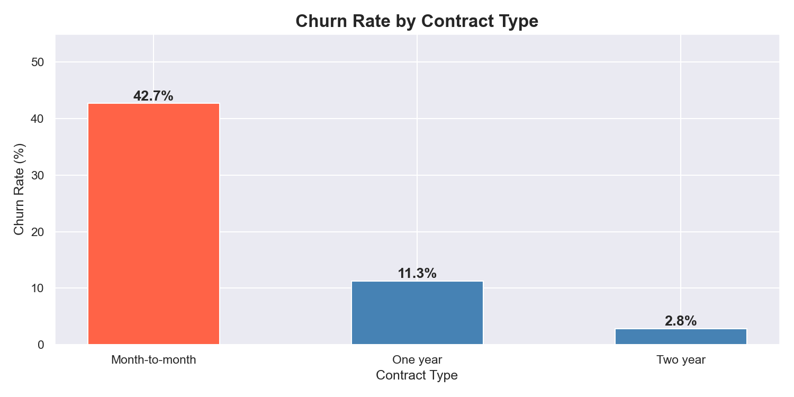
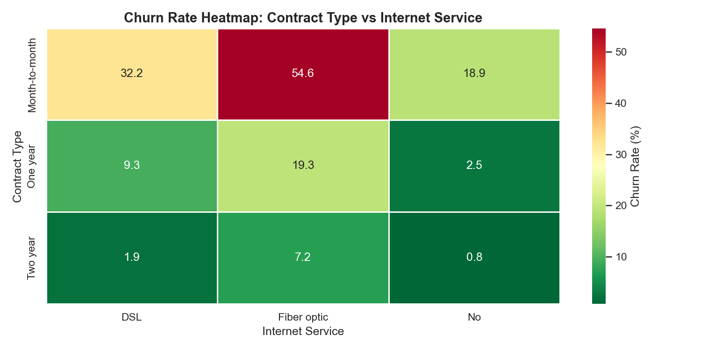
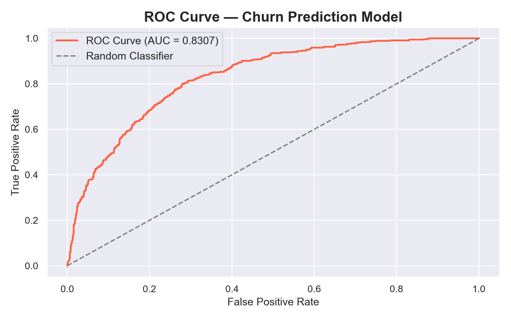

# 📊 Telecom Customer Churn Analysis

## 🔍 Project Overview
End-to-end data analysis project identifying key drivers of customer 
churn for a telecom company using Python, MySQL, and Machine Learning.

## 📁 Project Structure
```
telco_churn_analysis/
├── data/
│   ├── WA_Fn-UseC_-Telco-Customer-Churn.csv   ← raw data
│   └── telco_churn_clean.csv                   ← cleaned data
├── outputs/
│   ├── chart1_churn_distribution.png
│   ├── chart2_churn_by_contract.png
│   ├── chart3_churn_by_tenure.png
│   ├── chart4_monthly_charges.png
│   ├── chart5_churn_heatmap.png
│   ├── chart6_confusion_matrix.png
│   ├── chart7_roc_curve.png
│   └── chart8_feature_importance.png
├── 01_business_understanding.ipynb             ← main notebook
└── README.md
```

## 🛠️ Tools Used
- **Python** — Pandas, Matplotlib, Seaborn, Scikit-learn
- **MySQL** — 10 business queries for customer segmentation
- **Jupyter Notebook** — end-to-end documented analysis

## 📊 Dataset
- **Source:** IBM Telco Customer Churn Dataset via Kaggle
- **Size:** 7,032 customers × 20 features
- **Target:** Churn (Yes/No)

## 🔍 Key Business Insights

| # | Insight | Impact |
|---|---------|--------|
| 1 | Month-to-month customers churn at 42.71% vs 2.85% for 2-year contracts | Critical |
| 2 | 47.68% of customers churn within first 12 months | Critical |
| 3 | Electronic check users churn at 3x the rate of auto-pay users | High |
| 4 | Company loses $139,130 every month to churn | High |
| 5 | Highest risk segment: Month-to-month + Fiber Optic + Electronic check = 60.37% churn | Critical |

## 🤖 Model Performance

| Metric | Score |
|--------|-------|
| Accuracy | 78.54% |
| ROC-AUC | 0.8307 |

## 📈 Sample Visualizations

### Churn by Contract Type


### Churn Heatmap


### ROC Curve


## 💡 Business Recommendations
1. Incentivise month-to-month customers to upgrade to annual contracts
2. Build a 90-day onboarding programme for new customers
3. Offer discounts for switching to automatic payment methods
4. Use the ML model to proactively flag and retain high-risk customers

## 👤 Author
**Neel Vora**
[LinkedIn](https://linkedin.com/in/yourprofile) | 
[GitHub](https://github.com/OmegaSparkzz)
